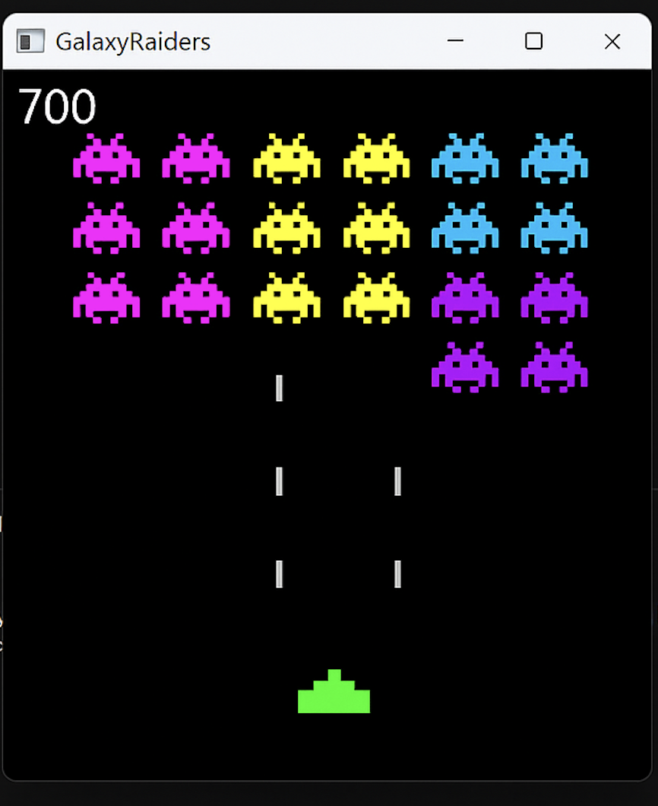

# GalaxyRaiders

GalaxyRaiders is a retro-inspired 2D arcade shooter game built using Java and Swing. Blast your way through waves of colorful alien invaders in this fast-paced game that pays tribute to the classic Space Invaders — but with your own twist!

Here’s a look at GalaxyRaiders in action:

## Key Features

Smooth Keyboard Controls  
Move with arrow keys, shoot with the spacebar — classic, responsive arcade mechanics.

👾 Waves of Enemies  
Dodge and destroy multiple rows of pixel-style alien invaders as they descend.

💥 Collision-Based Shooting  
Accurate bullet collision detection makes each shot count.

📊 Score Tracking  
Your score updates in real time — can you beat your high score?

Modular Java Architecture  
Clean object-oriented structure using separate classes for the player, aliens, and bullets.

Consistent Game Loop  
Uses `javax.swing.Timer` for smooth frame rendering and animations.

---

## Built With

- Java  
- Java Swing  
- Object-Oriented Programming (OOP)

